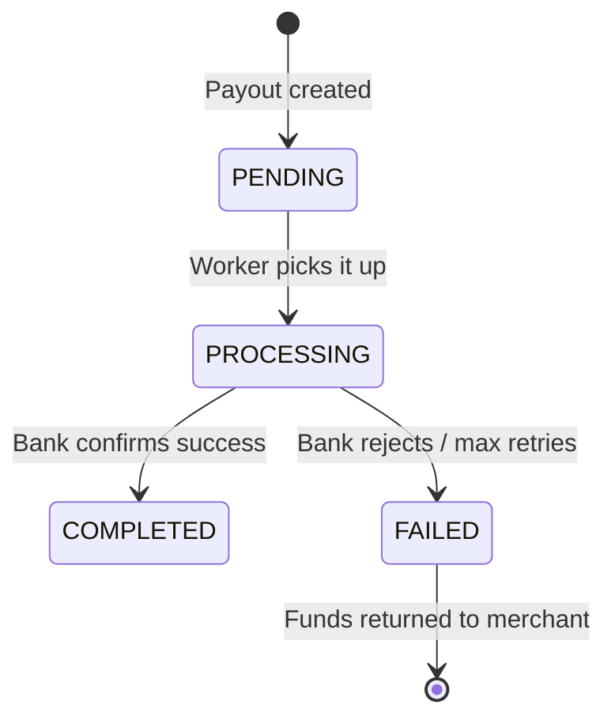

# Playto Payout Engine — Product Requirements Document (PRD)

---

## 1. Overview & Context

### What is Playto Pay?
Playto Pay is a **cross-border payment platform** for Indian freelancers, agencies, and online businesses. These are people who can't use Stripe or PayPal (because those don't fully support Indian merchants for receiving international payments).

### The Money Flow
```
International Client (USD) ──→ Playto Collects ──→ Merchant gets INR in their bank
```

### What Are You Building?
You're building the **Payout Engine** — the internal system that sits between "Playto collected money" and "Merchant gets it in their bank." Specifically:

1. **Track how much each merchant has earned** (their balance/ledger)
2. **Let merchants request withdrawals** (payouts to their bank)
3. **Process those payouts reliably** in the background
4. **Show all of this** in a simple dashboard

### What You're NOT Building
- ❌ The actual payment collection from international clients
- ❌ Real bank integration (you'll simulate it)
- ❌ Currency conversion
- ❌ User authentication/signup (seed merchants directly)

---

## 2. The Problem in One Line

> Build a wallet + withdrawal system where money never gets lost, double-spent, or corrupted — even when things go wrong (network retries, simultaneous requests, background job failures).

---

## 3. Tech Stack (Mandatory)

| Layer | Technology |
|-------|-----------|
| **Backend** | Django + Django REST Framework (DRF) |
| **Frontend** | React + Tailwind CSS |
| **Database** | PostgreSQL (strongly preferred) |
| **Background Jobs** | Celery, Django-Q, or Huey (pick one) |
| **Deployment** | Any free platform (Railway, Render, Fly.io, Koyeb) |

> [!IMPORTANT]
> Background jobs **must** be real async workers. You cannot fake it with synchronous code — they'll check.

---

## 4. Core Features

### Feature 1: Merchant Ledger

**What it is:** Every merchant has a "wallet." Their balance is calculated from a history of **credits** (money coming in) and **debits** (money going out / payouts).

**Key Rules:**
- All amounts are stored in **paise** (1 INR = 100 paise) as **integers**
- Balance = Sum of all credits − Sum of all debits
- Balance must be computed from the database, not from a cached "balance" field
- Seed 2–3 merchants with fake credit history (simulate past customer payments)

**Example:**
```
Merchant "Arnav's Agency"
  + ₹50,000 credit (customer payment)     → +5000000 paise
  + ₹30,000 credit (another payment)      → +3000000 paise
  - ₹20,000 debit  (payout to bank)       → -2000000 paise
  ─────────────────────────────────────────
  Balance: ₹60,000                         = 6000000 paise
```

### Feature 2: Payout Request API

**Endpoint:** `POST /api/v1/payouts/`

**Request:**
```http
POST /api/v1/payouts/
Idempotency-Key: <merchant-supplied UUID>   ← in the header
Content-Type: application/json

{
  "amount_paise": 5000000,
  "bank_account_id": "ba_123456"
}
```

**What happens:**
1. Validate the merchant has enough **available** balance (total balance minus already-held funds)
2. Create a payout record in `PENDING` state
3. **Hold the funds** (record the debit so balance is reduced immediately)
4. Queue the payout for background processing
5. Return the payout details

**Idempotency behavior:**
- If someone calls this with the same `Idempotency-Key`, return the **exact same response** as the first call
- Do NOT create a second payout
- Keys are scoped per merchant (two different merchants can use the same UUID)
- Keys expire after 24 hours

### Feature 3: Payout Processor (Background Worker)

**What it does:** Picks up `PENDING` payouts and moves them through their lifecycle by simulating a bank API call.

**Simulated outcomes:**
| Outcome | Probability | Action |
|---------|-------------|--------|
| **Success** | 70% | Move to `COMPLETED` — payout is final |
| **Failure** | 20% | Move to `FAILED` — **return held funds to merchant balance** |
| **Hang** | 10% | Stay in `PROCESSING` — simulates a timeout |

**Retry Logic:**
- If a payout is stuck in `PROCESSING` for > 30 seconds → retry
- Use **exponential backoff** (e.g., retry after 30s, 60s, 120s)
- Max **3 attempts**
- After 3 failed attempts → move to `FAILED` and return funds

### Feature 4: Merchant Dashboard (React)

**What it shows:**

| Section | Details |
|---------|---------|
| **Available Balance** | Total balance minus held amount |
| **Held Balance** | Amount locked in pending/processing payouts |
| **Recent Activity** | List of credits (money in) and debits (money out) |
| **Payout Form** | Amount field + bank account selector + submit button |
| **Payout History** | Table of all payouts with status, amount, timestamps |
| **Live Status** | Payout statuses update in near-real-time (polling is fine) |

> [!NOTE]
> The UI doesn't need to be pixel-perfect. It needs to be functional and clear. But making it look good with Tailwind is a plus.

---

## 5. Technical Constraints (The Hard Parts)

These are what they **actually grade you on**. Features are table stakes.

### 5.1 Money Integrity

| Rule | Why |
|------|-----|
| Use `BigIntegerField` for all amounts | Floats cause rounding errors with money (e.g., 0.1 + 0.2 ≠ 0.3) |
| Store in **paise** (integer) | ₹500.50 → `50050` paise. No decimals ever. |
| Calculate balance in the **database** | Use `SUM()` aggregation in SQL, not Python `sum()` on fetched rows |
| The invariant: `SUM(credits) - SUM(debits) == displayed balance` | This MUST always be true. They will check. |

**❌ Wrong:**
```python
# BAD - fetching rows and adding in Python
entries = LedgerEntry.objects.filter(merchant=merchant)
balance = sum(e.amount for e in entries)  # Race condition!
```

**✅ Right:**
```python
# GOOD - database-level aggregation
balance = LedgerEntry.objects.filter(
    merchant=merchant
).aggregate(balance=Sum('amount'))['balance'] or 0
```

### 5.2 Concurrency Control

**The scenario they'll test:**
> Merchant has ₹100. Two requests come in simultaneously, each trying to withdraw ₹60. Only ONE should succeed. The other must fail.

**The bug they're looking for ("check-then-deduct"):**
```
Thread 1: Check balance → 100 ✓ (enough for 60)
Thread 2: Check balance → 100 ✓ (enough for 60)  ← RACE CONDITION
Thread 1: Deduct 60 → balance = 40
Thread 2: Deduct 60 → balance = -20  ← OVERDRAFT BUG
```

**The fix:** Use PostgreSQL's `SELECT ... FOR UPDATE` (row-level locking):
```python
with transaction.atomic():
    # Lock the merchant's rows so no one else can read them
    merchant = Merchant.objects.select_for_update().get(id=merchant_id)
    balance = calculate_balance(merchant)  # DB-level SUM
    if balance < amount:
        raise InsufficientFunds()
    # Create debit entry (still inside the lock)
    LedgerEntry.objects.create(merchant=merchant, amount=-amount, ...)
```

### 5.3 Idempotency

**What:** If the client sends the same request twice (same `Idempotency-Key`), return the same result without creating a duplicate.

**Implementation approach:**
1. Store idempotency keys in a table: `(key, merchant_id, response, created_at)`
2. On every request, check if key exists for this merchant
3. If yes → return saved response
4. If no → process normally, save response with key
5. Handle the edge case: what if Request 1 is still processing when Request 2 arrives? (Use a DB lock or status field)
6. Keys expire after 24 hours (cleanup via cron/celery beat)

### 5.4 State Machine

Payouts have a strict lifecycle:



**Legal transitions:** `PENDING → PROCESSING → COMPLETED` or `PENDING → PROCESSING → FAILED`

**Illegal transitions (must be blocked in code):**
- `COMPLETED → anything` (completed is final)
- `FAILED → anything` (failed is final)
- `PROCESSING → PENDING` (can't go backwards)
- Any skipping (e.g., `PENDING → COMPLETED`)

**Where to enforce this:**
```python
VALID_TRANSITIONS = {
    'PENDING': ['PROCESSING'],
    'PROCESSING': ['COMPLETED', 'FAILED'],
    'COMPLETED': [],    # terminal state
    'FAILED': [],       # terminal state
}

def transition(payout, new_status):
    if new_status not in VALID_TRANSITIONS.get(payout.status, []):
        raise InvalidStateTransition(f"Cannot go from {payout.status} to {new_status}")
    payout.status = new_status
    payout.save()
```

### 5.5 Retry Logic with Exponential Backoff

```
Attempt 1: Process payout → hangs (stuck in PROCESSING)
  Wait 30 seconds...
Attempt 2: Retry → hangs again
  Wait 60 seconds...
Attempt 3: Retry → hangs again
  → Mark as FAILED, return funds to merchant
```

**Key fields on Payout model:**
- `retry_count` (int, default 0)
- `last_attempted_at` (datetime)
- `max_retries = 3`

---

## 6. Data Models

### Merchant
| Field | Type | Notes |
|-------|------|-------|
| `id` | UUID / Auto PK | Primary key |
| `name` | CharField | Business name |
| `email` | EmailField | Contact email |
| `created_at` | DateTimeField | auto_now_add |

### BankAccount
| Field | Type | Notes |
|-------|------|-------|
| `id` | UUID / Auto PK | Referenced in payout requests |
| `merchant` | ForeignKey(Merchant) | Owner |
| `account_number` | CharField | Masked for display |
| `ifsc_code` | CharField | Bank routing code |
| `account_holder_name` | CharField | Name on account |

### LedgerEntry
| Field | Type | Notes |
|-------|------|-------|
| `id` | UUID / Auto PK | |
| `merchant` | ForeignKey(Merchant) | |
| `amount` | **BigIntegerField** | Positive = credit, Negative = debit |
| `entry_type` | CharField | `CREDIT` or `DEBIT` |
| `description` | CharField | "Customer payment", "Payout #xyz" |
| `reference_id` | CharField (nullable) | Links to payout if it's a debit |
| `created_at` | DateTimeField | auto_now_add |

> [!TIP]
> You can model credits as positive amounts and debits as negative amounts in a single `amount` field. Then `SUM(amount)` gives you the balance directly.

### Payout
| Field | Type | Notes |
|-------|------|-------|
| `id` | UUID | Primary key |
| `merchant` | ForeignKey(Merchant) | |
| `amount_paise` | **BigIntegerField** | Amount in paise |
| `bank_account` | ForeignKey(BankAccount) | Target bank |
| `status` | CharField | `PENDING`, `PROCESSING`, `COMPLETED`, `FAILED` |
| `idempotency_key` | CharField | From request header |
| `retry_count` | IntegerField | Default 0, max 3 |
| `last_attempted_at` | DateTimeField (nullable) | When last processed |
| `created_at` | DateTimeField | auto_now_add |
| `updated_at` | DateTimeField | auto_now |

### IdempotencyKey
| Field | Type | Notes |
|-------|------|-------|
| `key` | CharField | The UUID from the header |
| `merchant` | ForeignKey(Merchant) | Scoped per merchant |
| `response_data` | JSONField | Cached response body |
| `response_status` | IntegerField | HTTP status code |
| `created_at` | DateTimeField | For 24-hour expiry |

**Unique constraint:** `(key, merchant)` — same key can be used by different merchants.

---

## 7. API Contracts

### `POST /api/v1/payouts/`

**Headers:**
```
Idempotency-Key: 550e8400-e29b-41d4-a716-446655440000
```

**Request Body:**
```json
{
  "amount_paise": 5000000,
  "bank_account_id": "ba_123"
}
```

**Success Response (201 Created):**
```json
{
  "id": "pay_abc123",
  "merchant_id": "m_001",
  "amount_paise": 5000000,
  "bank_account_id": "ba_123",
  "status": "PENDING",
  "created_at": "2026-04-25T10:00:00Z"
}
```

**Idempotent Replay (200 OK):** Same body as original response.

**Insufficient Balance (400):**
```json
{
  "error": "insufficient_balance",
  "message": "Available balance is 3000000 paise, requested 5000000 paise"
}
```

### `GET /api/v1/merchants/{id}/balance/`

**Response:**
```json
{
  "merchant_id": "m_001",
  "total_balance_paise": 8000000,
  "available_balance_paise": 6000000,
  "held_balance_paise": 2000000
}
```

### `GET /api/v1/merchants/{id}/ledger/`

**Response:**
```json
{
  "entries": [
    {
      "id": "le_001",
      "amount_paise": 5000000,
      "entry_type": "CREDIT",
      "description": "Payment from client@example.com",
      "created_at": "2026-04-20T09:00:00Z"
    },
    {
      "id": "le_002",
      "amount_paise": -2000000,
      "entry_type": "DEBIT",
      "description": "Payout pay_abc123",
      "created_at": "2026-04-21T14:00:00Z"
    }
  ]
}
```

### `GET /api/v1/merchants/{id}/payouts/`

**Response:**
```json
{
  "payouts": [
    {
      "id": "pay_abc123",
      "amount_paise": 2000000,
      "status": "COMPLETED",
      "bank_account_id": "ba_123",
      "created_at": "2026-04-21T14:00:00Z",
      "updated_at": "2026-04-21T14:01:30Z"
    }
  ]
}
```

---

## 8. What They're Actually Grading

| Criteria | Weight | What They Want to See |
|----------|--------|----------------------|
| **Clean Ledger Model** | 🔴 High | BigIntegerField, DB-level SUM, credits-debits invariant holds |
| **Concurrency Handling** | 🔴 High | `select_for_update()`, no double-spend possible |
| **Idempotency** | 🔴 High | Duplicate requests return same response, no duplicate payouts |
| **State Machine** | 🟡 Medium | Invalid transitions blocked, atomic fund returns |
| **EXPLAINER.md** | 🔴 High | Can you explain YOUR code? This is where most fail. |
| **AI Audit** | 🟡 Medium | Honest example of catching bad AI-generated code |
| **Working Deployment** | 🟡 Medium | Seeded with test data, accessible |
| **Tests** | 🟡 Medium | At least 1 concurrency test + 1 idempotency test |
| **UI Polish** | 🟢 Low | Functional > pretty, but don't make it ugly |

---

## 9. Deliverables Checklist

- [ ] **GitHub Repo** with clean commit history (not one giant commit)
- [ ] **README.md** — setup instructions (clone, install, migrate, seed, run)
- [ ] **Seed Script** — populates 2–3 merchants with credit history
- [ ] **Concurrency Test** — proves two simultaneous withdrawals don't overdraw
- [ ] **Idempotency Test** — proves duplicate keys return same response
- [ ] **EXPLAINER.md** — answers all 5 questions with actual code snippets
- [ ] **Live Deployment** — seeded with test data, URL shared in form
- [ ] **Submission Form** — GitHub URL + deployed URL + "proudest thing"

### Optional Bonuses (pick 1–2 max):
- [ ] `docker-compose.yml` for one-command setup
- [ ] Event sourcing for the ledger
- [ ] Webhook delivery with retries
- [ ] Audit log for all state changes

---

## 10. Suggested Implementation Order

This is a suggested plan to complete in ~12 hours across 5 days:

### Day 1: Foundation (3 hours)
1. Set up Django + DRF + PostgreSQL + Celery/Huey
2. Create models: Merchant, BankAccount, LedgerEntry, Payout, IdempotencyKey
3. Write migrations
4. Create seed script (management command)

### Day 2: Core API (3 hours)
4. Build balance calculation (DB-level aggregation)
5. Build `POST /api/v1/payouts/` with:
   - Idempotency check
   - Balance validation with `select_for_update`
   - Ledger entry creation (debit)
   - Queue background job
6. Build GET endpoints for balance, ledger, payouts

### Day 3: Background Worker + State Machine (3 hours)
7. Implement payout processor task
8. Simulate bank responses (70/20/10 split)
9. State machine validation
10. Retry logic with exponential backoff
11. Atomic fund-return on failure

### Day 4: Frontend + Tests (3 hours)
12. React dashboard with Tailwind
13. Balance display, payout form, payout history
14. Polling for live status updates
15. Write concurrency test
16. Write idempotency test

### Day 5: Deploy + Document (2 hours)
17. Deploy to Railway/Render
18. Seed production data
19. Write EXPLAINER.md (paste actual code, explain decisions)
20. Write README.md
21. Clean up commit history
22. Submit

---

## 11. Common Pitfalls to Avoid

> [!CAUTION]
> **These are the mistakes that get people rejected:**

1. **Using `FloatField` or `DecimalField` for money** — Use `BigIntegerField` in paise
2. **Calculating balance in Python** — Use `django.db.models.Sum` in a queryset
3. **No database locking on payout creation** — Must use `select_for_update()` inside `transaction.atomic()`
4. **Sync background processing** — Don't use `time.sleep()` in a view. Use Celery/Huey/Django-Q
5. **One giant git commit** — Make 10–20 meaningful commits as you build
6. **Empty EXPLAINER.md** — This is where most people fail. Be specific, paste code.
7. **Skipping tests** — At minimum: 1 concurrency + 1 idempotency test
8. **Not seeding the deployment** — The live URL must have test data
9. **Trusting AI blindly** — The AI Audit question is about intellectual honesty
